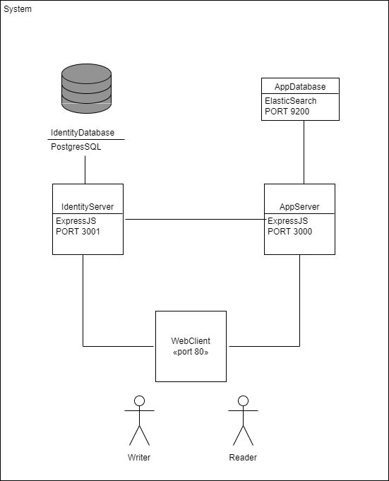

# Documentation

## 1. Architecture

### 1.1 System components
1.) [WebClient](../src/client/web/angular/README.md) - responsible for user interaction  
2.) [PostServer](../src/server/post/expressjs/README.md) - responsible for post related business logic  
3.) [PostDatabase](../src/db/post/elasticsearch/README.md) - responsible for post related data  
4.) [IdentityServer](../src/server/identity/expressjs/README.md) - responsible for user related business logic  
5.) [IdentityDatabase](../src/db/identity/postgres/README.md) - responsible for user related data

  
see [UML](./system-components.uxf) for more detailed info
