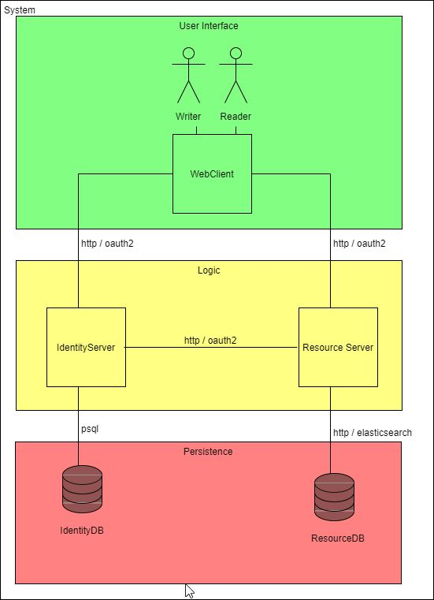

# Documentation

## 1. Architecture

### 1.1 System components
1.) [WebClient](../src/client/web/angular/README.md) - responsible for user interaction  
2.) [ResourceServer](../src/server/resource/expressjs/README.md) - responsible for resource related business logic  
3.) [ResourceDatabase](../src/db/resource/elasticsearch/README.md) - responsible for resource related data  
4.) [IdentityServer](../src/server/identity/expressjs/README.md) - responsible for user related business logic  
5.) [IdentityDatabase](../src/db/identity/postgres/README.md) - responsible for user related data

  
see [UML](./system-components.uxf) for more detailed info

## 2. OAuth2

### 2.1 Authorized resource server
After this process, a CLIENT_ID and CLIENT_SECRET will be created. These are used by the resource server to authenticate himself on the authentication provider. Another common requirement when configuring the app is to register the url of the endpoint on the resource server to where the authentication provider will redirect the client.

## 3. File Tree

